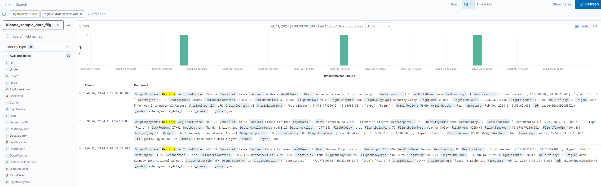
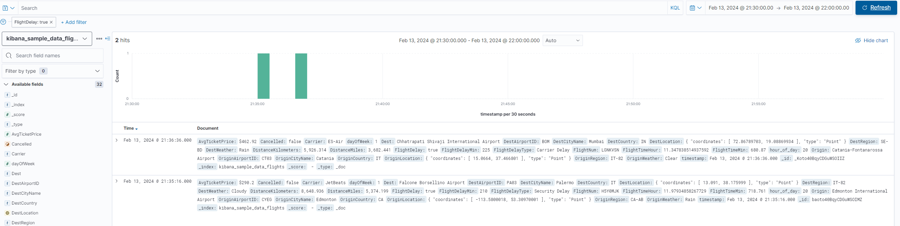
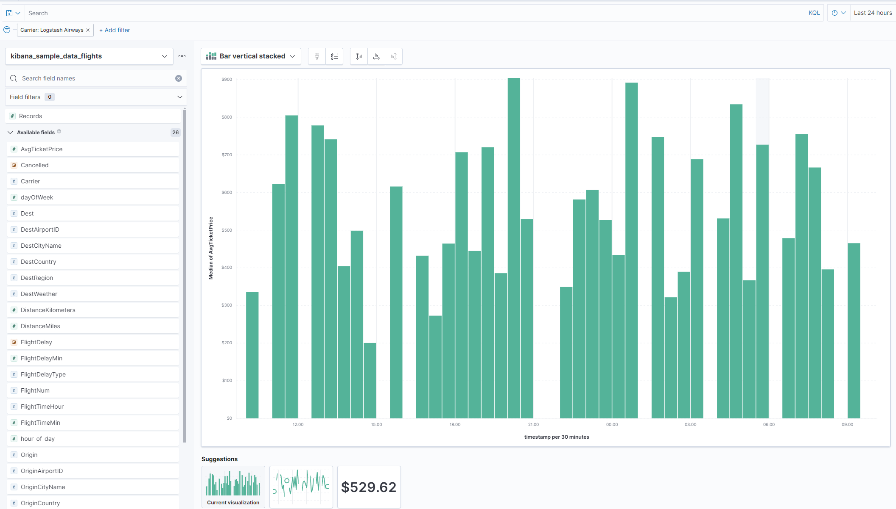
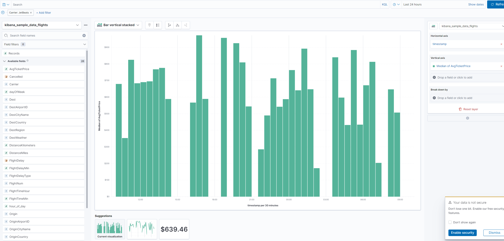
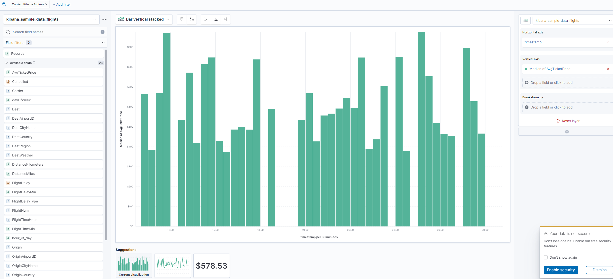
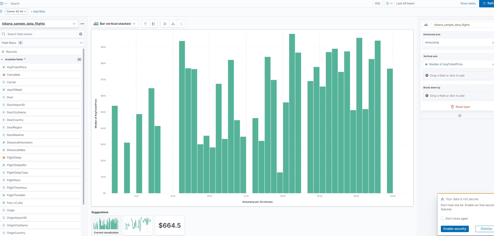
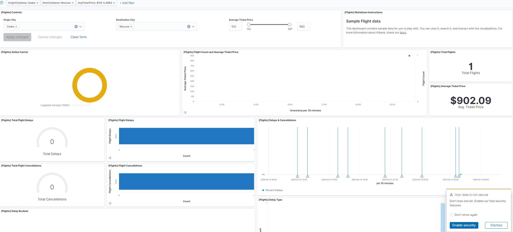
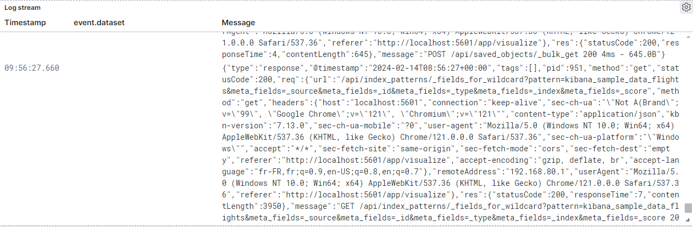
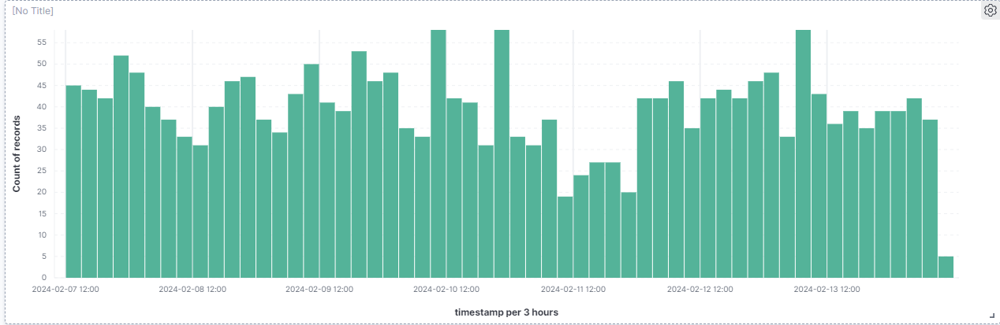

ElasticSearch

Exercice 1 :

Exercice 2 :
1-

2-

Recherche dans Kibana :

Exercice 1 :

Tous les avions en provenance de New York qui ont eu du retard ?

La quantité d’avions ayant eu du retard hier soir entre 21h30 et 22h ?

Le prix moyen des billets par compagnie avec une visualisation ?

Aller dans la section dashboard. Explorer les différentes visualisations pour comprendre de quoi elles parlent

Exercices supplémentaires :

requête pour analyser une erreur dans le code:

graphique sur le volume de connexion au cours de la journée

