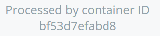
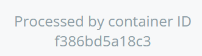
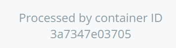
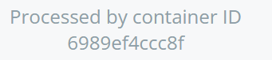
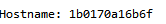
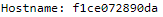
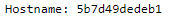

Lire attentivement les fichiers docker-compose.yml, docker-compose-simple.yml, docker-stack-simple.yml et docker-stack.yml. Ce sont tous des fichiers Docker Compose classiques avec différentes options liées à un déploiement via Swarm.
Quelles options semblent spécifiques à Docker Swarm ? Ces options permettent de configurer des fonctionnalités d’orchestration.

L'option deploy avec replicas et healthcheck.

Dessiner rapidement le schéma d’architecture associé au fichier docker-compose-simple.yml, puis celui associé à docker-stack.yml en indiquant bien à quel réseau quel service appartient.

Service docker-compose :

Service docker-stack: 

Qu’est-ce qu’un service dans la terminologie de Swarm ?

Ca permet de partager un conteneur en plusieurs répliques et de partager les tâches du conteneur.

Que signifie la ligne Processed by container ID […] ? Pourquoi varie-t-elle ?

C'est le container voter actif pour afficher la page, 
quand on recharge on change de container et on utilise une autre réplique du container voter donc son id change.

Scaler la stack en ajoutant des replicas du front-end lié au vote avec l’aide de docker service --help. Accédez à ce front-end et vérifier que cela a bien fonctionné en actualisant plusieurs fois.

Clustering entre ami·es

Avec un service :

Actualisez plusieurs fois la page. Les informations affichées changent. Lesquelles, et pourquoi ?
L'id de l'host change car on a réparti 5 services dans 2 noeuds différents, des qu'on recharge la page 
la tache est gérer par un container différent sur les 5 répliques.

Avec la stack example-voting-app: 

puis spécifier quelques options d’orchestration exclusives à Docker Swarm : que fait mode: global ? 

Le mode global est utilisé pour un créé un service qui n'a qu'une tâche en cours contrairement a replicas,
il ne sera pas partagé entre différents container.

Trouver la commande pour déchoir et promouvoir l’un de vos nœuds de manager à worker et vice-versa.

Promouvoir -> docker node promote
Dechoir -> docker node demote

Introduction a Kubernetes 

Lister les notions équivalentes : 

- Gestion des ports pour chaques services
- Gestion des deploys avec les replicas
- Gestion des containers et des images

